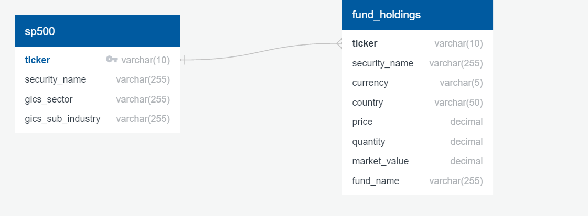
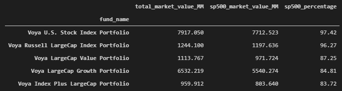
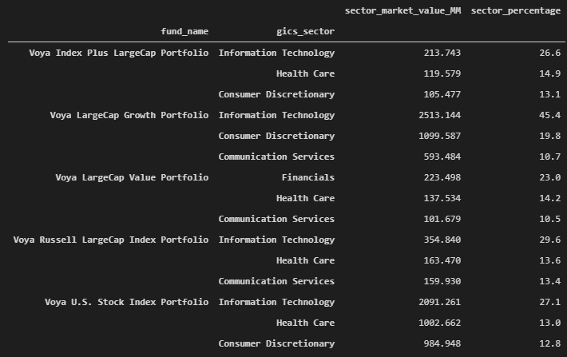

# UofA Data Analytics Bootcamp Project 2 - ETL (Extract, Transform, Load)

**Team**:  Tarak Patel, Nicole Lund, and Anne Niemiec

-----

## Project Description

Investors want to avoid mutual funds that contain similar holdings to what already exists in their portfolio. This project examines the holdings of 5 mutual funds of interest to determine what percentage of their holdings are S&P 500 companies and how the funds compare to each other.  This helps the investor build a diversified portfolio containing different stock strategies and gain insight into how much money should be invested in each mutual fund. 

This project collects mutual fund holdings data and S&P 500 data within a common database for analysis using an Extract, Transform, Load (ETL) pipeline.  Then SQL queries are run to determine if the selected funds can build a diversified portfolio.  SQL queries of interest include:
* Determining the percentage of S&P 500 companies included within each mutual fund and analyzing what percent of the entire portfolio is represented by S&P 500 securities to explain the diversification of the portfolio.
    * As an example, index funds map to the S&P 500 list so investors expect to see 80-100% of the index fund holdings containing S&P 500 securities. If an investor wants to purchase shares in an index fund, then they would want to include other mutual funds within their portfolio that contain less than 20% of S&P 500 companies in their holdings to increase diversification. Good examples would include Mid/Small Cap, International and fixed income mutual funds.
* Determining the statistics on sectors of stock holdings for the mutual funds to review an alternate diversification metric.

## Data Sources
* Mutual Fund Holdings Data (https://individuals.voya.com/product/variable-portfolio/holdings/monthly):  
    * Voya Index Plus Large Cap Excel File
    * Voya Large Cap Growth Excel File
    * Voya Large Cap Value Excel File
    * Voya Russell Large Cap Index Excel File
    * Voya US Stock Index Excel File
* S&P 500 Component Stocks HTML Table (https://en.wikipedia.org/wiki/List_of_S%26P_500_companies) 

## Data Extraction Methods
* Mutual Fund Holdings Data: Extract individual Excel files with Pandas read_excel function
* S&P 500 Component Stocks Table: Extract HTML table with Pandas read_html function

## Data Transformation
* Mutual Fund Holdings DataFrame Tables: 
    * Remove 3 header rows
    * Remove NaNs
    * Add column with mutual fund holding name
    * Merge into one Pandas DataFrame via Pandas concat function
    * Set index to ticker and fund_name columns
* S&P 500  DataFrame Table:
    * Remove extraneous columns
    * Set index to ticker column
* All  DataFrame Tables
    * Confirm the data is clean
    * Rename columns to common format between both tables
    * Convert Jupyter notebooks to Python scripts for use with master run file

## Data Load
* Pre-plan database schema using https://app.quickdatabasediagrams.com/
* Use pandas and sqlalchemy to upload DataFrames to cloud-based SQL PostgreSQL database

## Data Analysis
* Query the database for fund holdings statistics:
    * Percentage of fund holdings containing S&P 500 securities
    * Percentage of S&P 500 fund holdings by sector

-----

## Repository Structure
* a_source_data: Downloaded mutual fund holdings Excel files
* b_holdings_cleanup: 
    * holdings_clean.ipynb: Jupyter notebook for developing the mutual fund holdings extraction and DataFrame cleanup technique.
    * holdings_clean.py: Converts the essential elements of holdings_clean.ipynb to a callable python script for use in run_all_ETL.py.
    * fund_holdings.csv: CSV export of final DataFrame created in holdings_clean.ipynb.
* c_sp500_scraping:  
    * sp500_scrape.ipynb: Jupyter notebook for developing the S&P 500 extraction and DataFrame cleanup technique.
    * sp500_scrape.py: Converts the essential elements of sp500_scrape.ipynb to a callable python script for use in run_all_ETL.py.
    * sp500.csv: CSV export of final DataFrame created in sp500_scrape.ipynb.
* d_database_diagram: Pre-planned PostgreSQL database schema scripts and diagram for reference in sql_load.py.
* e_sql_load/sql_load.py: Callable python script for creating the database tables for use in run_all_ETL.py.
* f_sql_analysis: 
    * sql.sql: postgreSQL query file.
    * sql_analysis.ipynb: Jupyter Notebook conversion of sql.sql.
    * sql_analysis.py: Converts the essential elements of sql_analysis.ipynb to a callable python script for use in run_all_ETL.py.
    * holdings_analysis_df.png: Screen capture of the holdings_analysis_df.
    * sector_analysis_df.png: Screen capture of the sector_analysis_df.
* postgres_pwd.py: User to update this file with their unique database host and credentials for use in run_all_ETL.py.
* project_etl_instructions.md: The initial assignment instructions for this project.
* run_all_ETL.py: This script runs all of the ETL components in sequence.

-----

## Project Run Instructions
1. Create a postgreSQL server and database
2. Enter the database host url, name, username and password into postgres_pwd.py
3. Execute run_all_ETL.py

-----

## Project Results
This project performed ETL (Extract, Transform and Load) on stock market funds and a table of S&P 500 stocks.  The ETL process built a Database with the following Schema. 

The database was queried to determine the diversification of the mutual funds of interest.

* All of the selected mutual funds hold more than 80% of their holdings in S&P 500 stocks. If we used this analysis to make an investment decision, we would only invest in the fund with the largest exposure to S&P 500 stocks (Voya U.S. Stock Index Portfolio), then continue looking for other funds containing less holdings overlap than the 5 mutual funds analyzed here.
 

* The sector weight shows that all the funds, except Voya Large Cap Growth fund, have similar diversification weights. The Voya Large Cap Growth fund is invested more in the Information Technology sector.  The client goals can help inform the decision for choosing between the analyzed stocks.  If the client is young, a Financial Advisor might advise investing in the Voya Large Cap Growth fund because it will perform slightly more aggressively than the other funds.  If the client is more conservative, then the Financial Advisor might recommend the Voya US stock Index fund which mirrors S&P 500. 

-----

## Citations
* Ltd, D. T. (n.d.). QuickDBD. QuickDatabaseDiagrams. https://app.quickdatabasediagrams.com/. 
* Monthly Variable Portfolio Holdings. Monthly Variable Portfolio Holdings | Voya Investment Management. (n.d.). https://individuals.voya.com/product/variable-portfolio/holdings/monthly.
* Wikimedia Foundation. (2021, June 4). List of S&amp;P 500 companies. Wikipedia. https://en.wikipedia.org/wiki/List_of_S%26P_500_companies. 