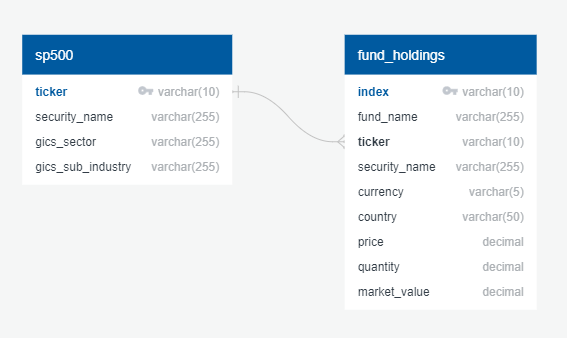

# UofA Data Analytics Bootcamp Project 2 - ETL (Extract, Transform, Load)

**Team**:  Tarak Patel, Nicole Lund, and Anne Niemiec

-----

## Project Description
Investigate the types of stock holdings of 5 Mutual Funds including the percentage of stocks in the funds that are on the S&P 500 list and sub-categories of funds in each fund.

## Data Sources
* Mutual Fund Holdings Data (https://individuals.voya.com/product/variable-portfolio/holdings/monthly):  
    * Voya Index Plus Large Cap Excel File
    * Voya Large Cap Growth Excel File
    * Voya Large Cap Value Excel File
    * Voya Russell Large Cap Index Excel File
    * Voya US Stock Index Excel File
* S&P 500 Component Stocks HTML Table (https://en.wikipedia.org/wiki/List_of_S%26P_500_companies) 

## Data Extraction Methods
* Mutual Fund Holdings Data: Extract individual Excel files with Pandas read_excel function
* S&P 500 Component Stocks Table: Extract HTML table with Pandas read_html function

## Data Transformation
* Mutual Fund Holdings DataFrame Tables: 
    * Remove 3 header rows
    * Remove NaNs
    * Add column with mutual fund holding name
    * Merge into one Pandas DataFrame via Pandas concat function
    * Set index to ticker and fund_name columns
* S&P 500  DataFrame Table:
    * Set index to ticker column
* All  DataFrame Tables
    * Confirm the data is clean
    * Rename columns to common format between both tables
    * Convert Jupyter notebooks to Python scripts for use with master run file

## Data Load
* Pre-plan database schema using https://app.quickdatabasediagrams.com/
* Use pandas and sqlalchemy to upload DataFrames to cloud-based SQL PostgreSQL database

## Data Analysis
*Replace with details*

-----

## Repository Structure
* a_source_data: Downloaded mutual fund holdings Excel files
* b_holdings_cleanup: 
    * holdings_clean.ipynb: Jupyter notebook for developing the mutual fund holdings extraction and DataFrame cleanup technique.
    * holdings_clean.py: Converts the essential elements of holdings_clean.ipynb to a callable script for use in run_all_ETL.py.
    * fund_holdings.csv: CSV export of final DataFrame created in holdings_clean.ipynb.
* c_sp500_scraping:  
    * sp500_scrape.ipynb: Jupyter notebook for developing the S&P 500 extraction and DataFrame cleanup technique.
    * sp500_scrape.py: Converts the essential elements of sp500_scrape.ipynb to a callable script for use in run_all_ETL.py.
    * sp500.csv: CSV export of final DataFrame created in sp500_scrape.ipynb.
* d_database_diagram: Pre-planned PostgreSQL database schema scripts and diagram for reference in sql_load.py
* e_sql_load/sql_load.py: Callable script for creating the database tables.
* f_sql_analysis: SQL queries and database analysis
* postgres_pwd.py: User to update this file with their unique database host and credentials for use in run_all_ETL.py
* project_etl_instructions.md: The initial assignment instructions for this project.
* run_all_ETL.py: This script runs all of the ETL components in sequence.

-----

## Project Run Instructions
1. Create a postgreSQL server and database
2. Enter the database host url, name, username and password in postgres_pwd.py
3. Execute run_all_ETL.py

-----

## Project Results
This project performed ETL (Extract, Transform and Load) on stock market funds and a table of S&P 500 stocks.  The ETL process built a Database with the following Schema. 

*Replace with further details*

-----

## Citations
* Ltd, D. T. (n.d.). QuickDBD. QuickDatabaseDiagrams. https://app.quickdatabasediagrams.com/. 
* Monthly Variable Portfolio Holdings. Monthly Variable Portfolio Holdings | Voya Investment Management. (n.d.). https://individuals.voya.com/product/variable-portfolio/holdings/monthly.
* Wikimedia Foundation. (2021, June 4). List of S&amp;P 500 companies. Wikipedia. https://en.wikipedia.org/wiki/List_of_S%26P_500_companies. 